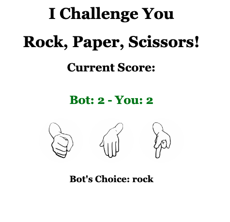

# Rock Paper Scissors! - A Bot Game 

 

Play Rock Paper Scissors with a Bot and track your score for each game.

 

Click [here to play Rock Paper Scissors!](https://natsal33.github.io/rockPaperScissors/)

 

## Summary
Rock Paper Scissors! is a user vs bot game in which the user chooses either rock, paper, or scissors and their opponent (the bot) chooses randomly from the three options. Each game ends in a win, a loss, or a tie and these scores are tallied up every page session to display the user's score vs the bot's. 
 
## Author

* **Natalie Salazar** - Software Developer in Training